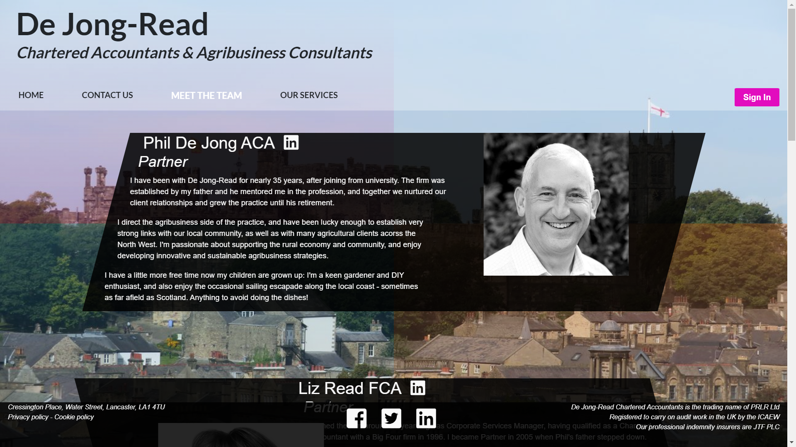
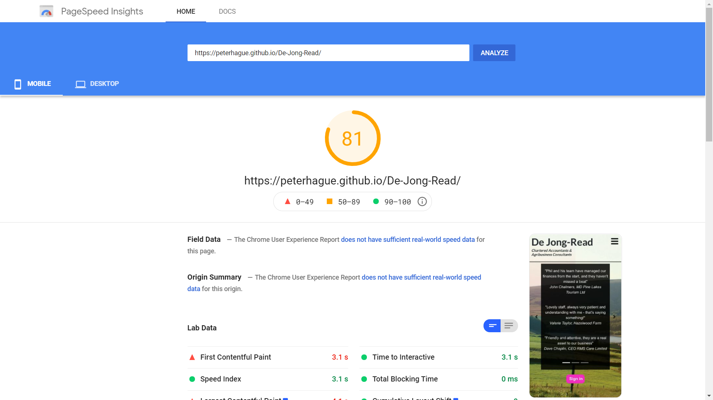

# De Jong-Read

<a href="https://peterhague.github.io/CI_MS1_De-Jong-Read/" target="_blank">View the deployed website</a>

<h2>Tabel of Content</h2>

<ol>
<li><a href="#project-goals">Project Goals</a></li>
<li><a href="#user-experience">User Experience</a></li>
<ol>
<li><a href="#target-audience">Target Audience</a></li>
<li><a href="#user-stories">User stories</a></li>
<li><a href="#scope">Scope</a></li>
<li><a href="#design">Design</a></li>
<li><a href="#wireframes">Wireframes</a></li>
</ol>
</li>
<li><a href="#features">Features</a></li>
<li><a href="#technologies-used">Technologies Used</a>
<ol>
<li><a href="#languages">Languages</a></li>
<li><a href="#frameworks-and-tools">Frameworks & Tools</a></li>
</ol>
</li>
<li><a href="#testing">Testing</a></li>
<ol>
<li><a href="#html-validation">HTML Validation</a></li>
<li><a href="#css-validation">CSS Validation</a></li>
<li><a href="#accessibility">Accessibility</a></li>
<li><a href="#performance">Performance</a></li>
<li><a href="#device-testing">Device testing</a></li>
<li><a href="#browser-compatibility">Browser compatibility</a></li>
<li><a href="#testing-user-stories">Testing user stories</a></li>
</ol>
<li><a href="#bugs">Bugs</a></li>
<li><a href="#deployment">Deployment</a></li>
<li><a href="#credits">Credits</a></li>
<ol>
<li><a href="#code">Code</a></li>
<li><a href="#media">Media</a></li>
<li><a href="#acknowledgements">Acknowledgements</a></li>
</ol>
</ol>

<h2 id="project-goals">Project Goals</h2>

The business goals of De Jong-Read Chartered Accountants and Agribusiness Consultants (DJR) are as follows:
<ul>
<li>To evidence that DJR is an integral part of the local business community</li>
<li>Explain the firm's unique services and offerings to potential clients</li>
<li>Introduce potential clients and employees to its key people in an attractive and no-nonsense manner</li>
<li>Provide an easy way for their existing clients to log on to the firm's cloud-based portal</li>
<li>Provide key contact information for interested parties</li>
</ul>

The user goals:
<ul>
<li>To find out what services the firm offers</li>
<li>To discover where DJR is based and how to get there</li>
<li>To be able to log in to the client portal easily and quickly</li>
<li>To understand the benefits of becoming a member at the various different membership levels</li>
<li>To be assured that DJR is a professional firm which provides excellent outcomes for its clients</li>
</ul>

<h2 id="user-experience">User Experience</h2>

The website is designed for ease of use on any screen size, with clearly separated and uncluttered content.
This has been achieved by avoiding long chunks of text and by keeping the pages short: auxillary content can often be accessed via modals and different carousel slides.

The main goals of the user experience design are, firstly, to attract them to become clients of DJR, and secondly, to allow existing clients to regsiter for and sign in to DJR's cloud-based client portal.

The first goal is achieved via prominent branding, and information about the company and its services as the first content of every page. The second goal is achieved by a prominent "Sign in" button call to action visible on every page load, on every device.

<h3 id="target-audience">Target Audience</h3>

<ul>
    <li>Existing clients</li>
    <li>Prospective clients</li>
    <li>Potential employees</li>
    <li>Local businesspeople</li>
</ul>

<h3 id="user-stories">User Stories</h3>

There are two main categories of user anticipated for the website: potential clients and employees (henceforth "potential stakeholders"), and existing clients and interested local businesspeople (henceforth "current stakeholders").

<h4>Potential Stakeholders</h4>

<ol>
    <li>As a potential stakeholder, I want to know where the firm is located.</li>
    <li>As a potential stakeholder, I want to know how to contact the firm and its key management personnel ("KMP").</li>
    <li>As a potential stakeholder, I want to find out what the firm does and what it can offer me.</li>
    <li>As a potential stakeholder, I want to know who the KMP are, what their skills and experience are, and links to their social media presence.</li>
    <li>As a potential stakeholder, I want to find out about the firm's membership scheme and its benefits.</li>
    <li>As a potential stakeholder, I want to discover the firm's culture and the personalities of the KMP.</li>
    <li>As a potential stakeholder, I want to know about the firm's competencies and how its existing clients view its services.</li>
</ol>

<h4>Current Stakeholders</h4>

<ol start="8">
    <li>As a current stakeholder, I want to be able to sign up to use the client portal.</li>
    <li>As a current stakeholder, I want to be able to qucikly and easily log in to the client portal.</li>
    <li>As a current stakeholder, I want to be able to easily sign up for the firm's weekly newsletter.</li>
    <li>As a current stakeholder, I want to see what the latest industry news is.</li>    
</ol>

<h4>Site Owner</h4>

<ol start="12">
    <li>As a site owner, I want potential stakeholders to understand what my firm does and encourage them to become clients or employees.</li>
    <li>As a site owner, I want potential stakeholders to understand that existing clients are happy and receive an excellent service.</li>
    <li>As a site owner, I want potential and existing stakeholders to understand that my firm plays an active part in the local business community and that its main specialism is agribusiness.</li>    
    <li>As a site owner, I want existing clients to be able to register for and log in to our client portal.</li>
    <li>As a site owner, I want all users to be as engaged with my business as possible, by reading our articles, signing up for services, and following us on social media.</li>
</ol>

<h2 id="scope">Scope</h2>

The project's scope in its initial release is limited to the following features:

<ul>
<li>Navigation bar to allow users to navigate the site quickly and easily, with contrasting text to show them which page they are currently looking at.</li>
<li>A footer (fixed to bottom on larger devices) with the firm's address, some statutory information, and links to the firm's social media pages.</li>
<li>Modal allowing users to sign in to the client portal, accessed via a "Sign In" button.</li>
<li>A home page with testimonials and a news section, from which users can easily navigate the site<./li>
<li>Carousel on the home page with three slides each giving three different testimonies from satisfied current clients.</li>
<li>"Latest Industry News" section with headlines, summaries, and full stories expandable via "Read more" buttons and full page modals.</li>
<li>A "Contact Us" page with all relevant information on how to find the firm, including an embedded Google map, directions to the office, and contact details.</li>
<li>A prominently displayed form calling users to sign up for the firm's free weekly newsletter</li>
<li>A large but easily readable form calling users to sign up for the firm's secure online portal.</li>
<li>A "Meet the Team" page with biographies of the key individuals of the firm, along with prominent and attractve photographs.</li>
<li>An "Our Services" page describing the different services the firm provides, in four broad categories.</li>
<li>A table advertising the firm's membership scheme, with a list of benefits cross-referenced to three different membership levels.</li>
</ul>

Features considered for later releases:

<ul>
    <li>A section on the homepage with case studies of work done for clients, detailing how specific problems were solved.</li>
    <li>A button in the navigation bar allowing users to book appointments with different team members, via a live calendar.</li>
    <li>A dynamic landing page which would load once on the first visit to the website in any one session, with animated elements giving a welcome and a brief summary of the firm and its unique offerings.</li>
    <li>A section about the firm's trainees and more junior staff, providing updates on their qualification progress and the support the firm offers, partly to further familiarise users with all aspects of the firm and partly to encourage prospective trainees to join the firm.
</ul>

<h2 id="design">Design</h2>

The general aesthetic is designed to be a mix of the modern and traditional, to reflect the nature of a dynamic professional practice which has deep roots in a legacy industry like agriculture.

As such, there are minimalist and modern elements, such as the simple logo, and the extended use of angular containers, contrasted with background images of attractive local environments. These are in turn filtered through opaque coloured squares arranged in a four-pane window pattern as a deliberate homage to the famous Microsoft logo, to subtly impress on the user that this is a technologically fluent practice.

<h3>Colour Scheme</h3>

There is a deliberate contrast of austere black backgrounds and white text (and occasionally vice versa) with colourful backgrounds, to continue the "old and new" motif.

The new is represented by the minimalism of the black and white, and the old by the colourful backgrounds. The latter choice was also motivated by a desire to provide a source of colour, and to evoke a traditional tartan design: a visual language practically synonymous with countryside life.

<h3>Typography</h3>

For the heading, I used Lato from Google Fonts, and for most of the other text I used Quattrocento, also from Google Fonts

I chose Quattrocento because it seemed modern without being too rounded, to convery a relatively serious tone. I chose Lato in order to give a contrast from the main body of the page, and also because it is rather less plain than Quattrocento, and stylish enough to draw the eye to the business name.

<h3>Imagery</h3>

The images on the website are of two kinds: four different background images showing scenes of Lancaster and the surrounding countryside, and black and white photgraphs of the key team members.

The background images are deliberately beautiful, in order to establish in users' minds that this is a local firm, with a rural slant, and the pictures of the staff are black and white in order to contrast with the colourful background.

<h2 id="wireframes">Wireframes</h2>

Wireframes: <a href="docs/wireframes/home-wireframe.png">Home</a><a href="docs/wireframes/contact-us-wireframe.png"> Contact Us</a><a href="docs/wireframes/meet-the-team-wireframe.png"> Meet the Team</a><a href="docs/wireframes/our-services-wireframe.png"> Our Services</a>

<h2 id="features">Features</h2>

The website has twelve features across four pages.

<h3>Current Features</h3>

<h4>Feature 1: Home Page</h4>

The home page has two sections:

<ol>
    <li>A carousel with various testimonies from DJR's current clients praising the firm</li>
    <li>A news section with three stories from related to the accountancy industry</li>
</ol>

The page is fully responsive on mobile and tablet screen sizes.

The news stories were taken from similar websites and then tailored to the needs of the website - in terms of length, and content.
The testimonials were written by me.

This page, like all the pages, was constructed using Bootstrap grids, to aid responsiveness to various screen sizes.

<h4>Section 1: the carousel</h4>

This component was taken from the Bootstrap CDN, and then tailored for size, background colour, position on the page, and prominence of the left and right indicators.

I chose the black, slightly opaque background, and the hard rectangle container, for consistency with the overall design philosophy mentioned above.

<h4>Section 2: Latest Industry News</h4>

This section consists of three relevant news stories, with informative headlines and images, accessed by collapsible modals, which display full screen on mobiles and tablets with a light
background and dark text. I chose this because the dark theme seemed too oppresive when fully covering a smaller screen.

<h4>User stories covered by this feature:</h4>

User story 3: as a potential stakeholder, I want to find out what the firm does and what it can offer me.

User story 7: as a potential stakeholder, I want to know about the firm's competencies and how its existing clients view its services.

User story 9: as a current stakeholder, I want to be able to qucikly and easily log in to the client portal.

User story 11, as a current stakeholder, I want to see what the latest industry news is.

<h4>Feature 2: Contact Us page</h4>

The Contact Us page has three sections:

<ol>
    <li>A call to action to users to sign up to the firm's weekly newsletter, with an embedded form to input the necessary details.</li>
    <li>A call to action to users to sign up tot he firm's cloud-based client portal. This has a much longer and more sophisticated embedded form.</li>
    <li>A section detailing all relevant contact information, including directions, and an embedded Google Map.</li>
</ol>

The page is fully responsive on mobile and tablet screen sizes.

The copy for the two calls to action was written by me.

The social media and other icons were taken from the FontAwesome library.

This page, like all the pages, was constructed using Bootstrap grids, to aid responsiveness to various screen sizes.

<h4>Section 1: the newsletter call to action</h4>

This component includes a title and subtitle, calling to action and explaining the imperative, and a longer summary of the benefits of the newsletter, and finally a simple form.
The form is fully functional and won't submit until all the necessary fields are completed.

The submit button is deliberately large and prominent and I chose a circular form to try to convey a relatively fun, informal tone, which seemed appropriate for a free newsletter.
The inpput fields are rounded to continue that theme.

I chose the black, slightly opaque background, for consistency with the overall design philosophy mentioned above. I used slightly rounded corners for this componentto achieve a
slightly softer look.

The form maintains its basic structure across all devices sizes, albeit moves to a portrait format on mobiles and tablets. This is achieved by it populating more Bootstrap columns as the 
screen size reduces, as well as some fine-tuning via CSS media queries.

<h4>Section 2: portal registration call to action</h4>

This component includes a title and subtitle, calling to action and explaining the imperative, and a form with fourteen fields.
The form is fully functional and won't submit until all the necessary fields are completed, and it includes various different input types, such as date, text, email, password etc.

I chose the black, slightly opaque background, for consistency with the overall design philosophy mentioned above. I again used slightly rounded corners for this component, but made
the input fields only very slightly rounded, because that seemed to better suit the more business-like function of the form.

The form maintains its two-column structure on tablets, but becomes a single column on mobile: this is achieved via the Bootstrap responsive grid system, as well as some fine-tuning via CSS media queries.

<h4>Section 3: contact information</h4>

This component consists of a Bootstrap-defined container with two columnar sections: left for the directions and contact information, and right for the map embedded via an iframe element.

This means that the section is fully responsive for mobile and tablet, with smaller screens adopting a single column configuration, with the map beneath the directions. This has been fine-tuned
via media queries so that the directions and the map are visible on a mobile's roughly 9:16 aspect ratio without the need to scroll.

I chose the black, slightly opaque background, for consistency with the overall design philosophy mentioned above. I chose unrounded corners for this component, as that was a better fit as a frame for the map.

<h4>User stories covered by this feature:</h4>

User story 1: as a potential stakeholder, I want to know where the firm is located.

User story 2: as a potential stakeholder, I want to know how to contact the firm and its key management personnel ("KMP").

User story 8: as a current stakeholder, I want to be able to sign up to use the client portal.

User story 9, as a current stakeholder, I want to be able to qucikly and easily log in to the client portal.

User story 10, as a current stakeholder, I want to be able to easily sign up for the firm's weekly newsletter.

<h4>Feature 3: Meet the Team page</h4>

The meet the Team page has one section: it introduces users to the firm's five key members of staff. This is written as a single Bootstrap container, with one row for each of the staff in
desktop format, and two rows for mobile and tablet.

The responsive design was achieved by writing one section for desktop and then copying and editing that for mobile, and then again for tablet. Different display classes were then applied
to each of the classes as necessary. I did this because the designs were different enough that this was quicker than writing media queries (e.g. the name of the staff member is in a different row depending on the screen size).

The slanted boxes on this page were achieved via transform:skew CSS rules, and chosen to add variety and visual dynamism to the website.

I chose the black, slightly opaque background, for consistency with the overall design philosophy mentioned above.

The page is fully responsive on mobile and tablet screen sizes.

<h4>User stories covered by this feature:</h4>

User story 3: as a potential stakeholder, I want to find out what the firm does and what it can offer me.

User story 4: as a potential stakeholder, I want to know who the KMP are, what their skills and experience are, and links to their social media presence.

User story 6, as a potential stakeholder, I want to discover the firm's culture and the personalities of the KMP.

User story 9, as a current stakeholder, I want to be able to qucikly and easily log in to the client portal.

<h4>Feature 4: Our Services page</h4>

The Our Services page has two sections:

<ol>
    <li>A section describing the four broad categories of services the firm provides</li>
    <li>A table detailing the firm's membership programme, and the benefits attached to its three different levels.</li>
</ol>

<h4>Section 1: the firm's services</h4>

The responsive design was achieved by writing one section for desktop and then copying and editing that for mobile and tablet. Different display classes were then applied
to each of the sections as necessary. I did this because the designs were different enough that this was quicker than writing media queries (e.g. the left hand panes on desktop are resized and become headings on mobile and tablet).

I chose the black, slightly opaque background, for consistency with the overall design philosophy mentioned above. I opted for strict rectangles with no rounding because I wanted the title
panels to evoke the feeling of peering through windows to the scenery behind, and their counterpart descriptive panels therefore had to be the same shape for a pleasing symmetry.

All copy on the page was written by me.

<h4>Section 2: table summarising membership benefits</h4>

The table was also duplicated for mobile and tablet, simply in order to display on smaller screens as a fluid container spanning the entire viewport. This was sufficient for the table to display in a legible and uncluttered manner, viewable without scrolling on most mobile devices. Various media queries narrative contractions were made for some of the smaller and more unusual screen sizes and aspect ratios.

The icons in the table were sourced from Font Awesome's library.

<h4>User stories covered by this feature:</h4>

User story 3: as a potential stakeholder, I want to find out what the firm does and what it can offer me.

User story 5: as a potential stakeholder, I want to fidn out about the firm's membership scheme and its benefits.

User story 8, as a potential stakeholder, I want to know about the firm's competencies and how its existing clients view its services.

User story 9, as a current stakeholder, I want to be able to qucikly and easily log in to the client portal.

<h4>Feature 5: Navigation bar</h4>

The navigation bar is displayed across the four pages consistently, with some minor changes to colour scheme in order that text always contrasts fully with the backgrounds specific to each page.

It uses the Bootstrap navbar component to leverage Javascript functionality to collapse the bar on mobile and tablet devices and replace with a "burger bar" toggle button.

The desktop configuration also features a right-aligned (and therefore prominently isolated) "Sign In" call to action button. In mobile and tablet configurations, this button appears near the bottom of the viewport of each page's display on loading. This aids visibility, and also selection without the need to for users to obscure any of the page with their hand.

<h4>User stories covered by this feature:</h4>

User story 9, as a current stakeholder, I want to be able to qucikly and easily log in to the client portal.

User story 15, as a site owner, I want existing clients to be able to register for and log in to our client portal.

<h4>Feature 6: Footer</h4>

The footer is displayed at the bottom of all the website's pages. It is fixed to the bottom of the viewport on desktop and tablet devices.
The mobile configuration displays the items top to bottom, rather than left to right.

The footer displays mandatory statutory information related to the firm's professional registrations, its address, and social media links.

<h4>User stories covered by this feature:</h4>

User story 1, as a potential stakeholder, I want to know where the firm is located.

User story 16, as a site owner, I want all users to as engaged with my business as possible, by reading our articles, signing up for services, and following us on social media.

<h4>Feature 7: Sign In modal</h4>

This feature is accessed via Bootstrap data-toggle buttons, and displays a form requiring users to submit their login details. There is an optional additional modal for users who have forgotten their details, which works via Bootstrap's data-dismiss class. The modal content is responsive to all screen sizes and required some granular tuning of button size and placement for some of the smaller devices.

<h4>User stories covered by this feature:</h4>

User story 9, as a current stakeholder, I want to be able to qucikly and easily log in to the client portal.

User story 15, as a site owner, I want existing clients to be able to register for and log in to our client portal.

User story 16, as a site owner, I want all users to as engaged with my business as possible, by reading our articles, signing up for services, and following us on social media.

<h4>Feature 8: Testimonials carousel</h4>

This has been produced by editing Bootstrap's carousel component, by resizing the data indicators for enhanced visibility. It features three different slides each displaying three testimonies from DJR's satisfied clients. It is displayed prominently on the home page as an attractive first impression for new users, as well as to provide an immediate advertisment of the firm's qualities.

<h4>User stories covered by this feature:</h4>

User story 7, as a potential stakeholder, I want to know about the firm's competencies and how its existing clients view its services.

User story 12, as a site owner, I want potential stakeholders to understand what my firm does and eoncourage them to become clients or employees.

User story 13, as a site owner, I want potential stakeholders to understand that existing clients are happy and receive an excellent service.

<h4>Feature 9: News section with modal functionality</h4>

The news section features three stories each accessible as a full screen modal via underlined "Read more" calls to action. The modals are Bootstrap components, and feature a white background as I decided that the pervasive dark containers of the website were not suitable for reading extended content. On mobile devices the modals require scrolling, so I added anchor elements with "up" arrow icons to allow users to instantly return to the top of the story, and therefore to be able to access the close button without scrolling.

<h4>User stories covered by this feature:</h4>

User story 11, as a current stakeholder, I want to see what the latest industry news is.

User story 16, as a site owner, I want all users to as engaged with my business as possible, by reading our articles, signing up for services, and following us on social media.

<h4>Feature 10: Newsletter call to action with form</h4>

This component features a fully functional form that will not be submitted until all mandatory fields are completed in the appropriate format. The container is responsive for all screens and becomes centre-aligned on mobile devices.

<h4>User stories covered by this feature:</h4>

User story 10, as a current stakeholder, I want to be able to easily sign up for the firm's weekly newsletter.

User story 16, as a site owner, I want all users to as engaged with my business as possible, by reading our articles, signing up for services, and following us on social media.

<h4>Feature 11: Portal registration call to action with form</h4>

This component includes a long, fully-functional form with various input types. It uses the standard Bootstrap grid system to align two columns cleanly. It displays differently on mobile screens but retains all the same fields. The buttons required granular editing for size and placement on the various screen sizes.

<h4>User stories covered by this feature:</h4>

User story 8, as a current stakeholder, I want to be able to sign up to use the client portal.

User story 15, as a site owner, I want existing clients to be able to register for and log in to our client portal.

User story 16, a site owner, I want all users to as engaged with my business as possible, by reading our articles, signing up for services, and following us on social media.

<h4>Feature 12: Table of Membership Programme benefits</h4>

This component also uses Bootstrap grid system to produce a responsive design for tablet and mobile. The headings feature colourful, attractive icons, and data is displayed in large, easily legible fonts for maximal accessibility.

<h4>User stories covered by this feature:</h4>

User story 3, as a potential stakeholder, I want to find out what the firm does and what it can offer me.

User story 5, as a potential stakeholder, I want to find out about the firm's membership scheme and its benefits.

<h4>Features for Future Releases</h4>

<ol>
<li>A section on the homepage with case studies of work done for clients, detailing how specific problems were solved.</li>
<li>A button in the navigation bar allowing users to book appointments with different team members, via a live calendar.</li>
<li>A dynamic landing page which would load once on the first visit to the website in any one session, with animated elements giving a welcome and a brief summary of the firm and its unique offerings.</li>
<li>A section about the firm's trainees and more junior staff, providing updates on their qualification progress and the support the firm offers, partly to further familiarise users with all aspects of the firm and partly to encourage prospective trainees to join the firm.</li>
</ol>

<h2 id="technologies-used">Technologies Used</h2>

<h3 id="languages">Languages</h3>

<ul>
<li>HTML5</li>
<li>CSS3</li>
</ul>

<h3 id="frameworks-and-tools">Frameworks, libraries and other tools</h3>
<ol>
<li>Git
</li>
</ol>
<ul><li>Git was used for version control within VSCode to push the code to GitHub.</li></ul>
<ol start="2">
<li>GitHub</li>
</ol>
<ul><li>GitHub was used as a repository to stroe the project code.</li></ul>
<ol start="3">
<li>Balsamiq</li>
</ol>
<ul><li>Balsamiq was used to create all the wireframes for the site.</li></ul>
<ol start="4">
<li>Font Awesome</li>
</ol>
<ul><li>All the icoons on the site were sourced from the Font Awesome library.</li></ul>
<ol start="5">
<li>Google Fonts</li>
</ol>
<ul><li>Lato from font Awesome was used for the heading on each page, and the membership benefits table, and Quattrocento was used for the rest of the text on the site.</li></ul>
<ol start="6">
<li>Bootstrap v 4.13</li>
</ol>
<ul><li>Bootstrap's grid system was used to aid layout and responsiveness on each page. I also used Bootstrap's navigation bar, carousel, and modal components.</li></ul>
<ol start="7">
<li>Am I Responsive</li>
</ol>
<ul><li>Am I Resoinsive was used to create the multi-device mock-up image at the top of this README.</li></ul>
<ol start="8">
<li>ImageResizer.com</li>
</ol>
<ul><li>ImageResizer.com was used to compress image files in order to reduce the load on browsers.</li></ul>
<ol start="9">
<li>FreeConvert.com</li>
</ol>
<ul><li>FreeConvert.com was used to convert PNG image files to WEBP format to improve site performance.</li></ul>
<ol start="10">
<li>Visual Studio Code (VSCode)</li>
</ol>
<ul><li>VSCode was the IDE used for writing the project code.</li></ul>
<ol start="11">
<li>Google Maps</li>
</ol>
<ul><li>I used Google Maps to create the map embedded on the Contact Us page.</li></ul>

<h2 id="testing">Testing</h2>

<h3 id="html-validation">HTML Validation</h3>

The <a href="https://validator.w3.org/">W3C Markup Validation Service</a> was used for HTML validation of the site. All pages passed with 0 errors. The Index and Contact Us pages have warnings for lack of section headings, which is a stylistic choice.

<h3 id="css-validation">CSS Validation</h3>

The <a href="https://jigsaw.w3.org/css-validator/">W3C CSS Validation Service</a> was used for CSS validation of the site.

The CSS passed with zero errors.

<h3 id="accessibility">Accessibility</h3>

The <a href="https://wave.webaim.org/">WAVE Webaim Accessibility Tool</a>was used for accessibility validation of the site.

The website passed with no errors. There were several warnings, due either to stylistic choices or duplicated links (eg more than one linkedin link on the Meet the Team page.

<h3 id="performance">Performance</h3>

The <a href="https://developers.google.com/speed/pagespeed/insights/">Google PageSpeed Insights</a> tool was used for performance validation of the site.

All four pages of the website scored between 80 and 90 for overall performance.

<h3 id="device-testing">Performing tests on various devices</h3>
<h4>Devices tested:</h4>
<ul>
<li>Samsung Galaxy A7</li>
<li>HP laptop</li>
<li>Motorolla</li>
<li>Ipad Pro</li>
</ul>
<h4>Tests performed:</h4>
<ol>
<li>Page links in the navigation bar work as advertised, all links work correctly in the static navbar and the collapsible mobile configuration.</li>
<li>The testimonials carousel displays appropriately, and the indicators are visible and work correctly.</li>
<li>The news stories open in modals as intended, with no scrolling on larger screens and full screen display and scrolling on mobile. The "top of page" arrow button works correctly on these devices, and the close button dismisses the modal.</li>
<li>The "Sign In" modal opens up correctly closes on a click outside the content or the cross button. The "forgotten details" link opens the subsequent modal and closes the first, as intended.</li>
<li>The "Sign In" modal form blocks submission when a mandatory field has not been completed in the required format - error message displays as intended.</li>
<li>Footer links to external websites work correctly, and open in new tabs.</li>
<li>The footer content spans the screen on larger devices, and collapses to stack on mobiles, as intended.</li>
<li>The newsletter sign up form container displays appropriately on all devices, remaining attractive and legible. The form blocks submission where any mandatory field is left unpopulated. An appropriate error message is displayed.</li>
<li>The portal registration form displays in two columns on larger screens and a single column, as intended. Content is legible and uncluttered across all devices tested.</li>
<li>The portal registration form will not submit unless all mandatory fields are completed. An error message displays as intended when triggered.</li>
<li>The contact details container displays as two columns on larger devices and one column on mobile. The content is legible and uncluttered across devices.</li>
<li>The staff profile containers display as intended on desktop, tablet, and mobile: there are three different layouts. This content needed to be resized on mobile layout to make it more legible.</li>
<li>The services containers display as intended as side by side on desktop and tablet and columnar on mobile. The content and headings are legible and attractive in all configurations.</li>
<li>The membership benefits table retains its integrity on mobile, with slightly contracted wording where required and the sacrifice of horizontal margins. Table on mobile remains legible and largely viewable without scrolling, as intended.</li>
<li>Buttons have the intended softening in colour when hovered over, as intended.</li>
<li>Page header redirects to home page on all pages</li>
</ol>

All pages worked as intended on all devices. The one major change necessitated was to move the sign in button up a little in mobile mode, as I had not accounted for the screen real estate taken up by the browser elements.

<h3 id="browser-compatibility">Browser compatability</h3>
<ul>
<li><strong>Google Chrome:</strong>Website and user stories perform as intended.</li>
<li><strong>Firefox:</strong>Website and user stories perform as intended</li>
<li><strong>Opera:</strong>Website and user stories perform as intended</li>
<li><strong>Samsung Internet Browser:</strong>Website and user stories perform as intended.</li>
</ul>

<h3 id="testing-user-stories">Testing user stories</h3>

<em>1. As a potential stakeholder, I want to know where the firm is located.</em>

<table>
<tr>
<th>Feature</th>
<th>Action</th>
<th>Expected result</th>
<th>Actual result</th>
</tr>
<tr>
<td>Address and directions details on Contact Us page</td>
<td>Click on 'Contact Us' in the navigation bar and scroll down to find the section.</td>
<td>Find address and directions on Contact Us page</td>
<td>works ass expected</td>
</tr>
</table>

<a href="docs/user-stories/us1.png">See User Story 1 images</a>

<em>2. As a potential stakeholder, I want to know how to contact the firm and its key management personnel ("KMP").</em>

<table>
<tr>
<th>Feature</th>
<th>Action</th>
<th>Expected result</th>
<th>Actual result</th>
</tr>
<tr>
<td>Contact details on Contact Us page</td>
<td>Click on 'Contact Us' in the navigation bar and scroll down to find the section.</td>
<td>Find contact details on Contact Us page</td>
<td>Works as expected</td>
</tr>
<tr>
<td>Links to KMP linkedin profiles on Meet the Team page</td>
<td>Click on 'Meet the Team' in the navigation bar and find the linkedin icon next to the name of all key team members. Click on the icon to go to their linkedin profile.</td>
<td>Find how to contact key management personnel.</td>
<td>works as exxpected.</td>
</tr>
</table>

<a href="docs/user-stories/us2.png">See User Story 2 images</a>

<em>3. As a potential stakeholder, I want to find out what the firm does and what it can offer me.</em>

<table>
<tr>
<th>Feature</th>
<th>Action</th>
<th>Expected result</th>
<th>Actual result</th>
</tr>
<tr>
<td>Our Services page explaining the firm's services</td>
<td>Click on 'Our Services' in the navigation bar and scroll down to discover each of four broad services categories. Scroll to the end to find details of the firm's membership programme.</td>
<td>Find out what the firm offers.</td>
<td>Works as expected.</td>
</tr>
</table>

<a href="docs/user-stories/us3.png">See User Story 3 images</a>

<em>4. As a potential stakeholder, I want to know who the KMP are, what their skills and experience are, and links to their social media presence.</em>

<table>
<tr>
<th>Feature</th>
<th>Action</th>
<th>Expected result</th>
<th>Actual result</th>
</tr>
<tr>
<td>Links to KMP linkedin profiles on Meet the Team page</td>
<td>Click on 'Meet the Team' in the navigation bar and find the linkedin icon next to the name of all key team members, along with a sumamry of professional history.</td>
<td>Find out who the KMP are and what their experience is.</td>
<td>works as expected.</td>
</tr>
</table>

<a href="docs/user-stories/us4.png">See User Story 4 images</a>

<em>5. As a potential stakeholder, I want to find out about the firm's membership scheme and its benefits.</em>

<table>
<tr>
<th>Feature</th>
<th>Action</th>
<th>Expected result</th>
<th>Actual result</th>
</tr>
<tr>
<td>Table listing the benefits of membership across the 3 different levels</td>
<td>Click on 'Our Services' in the navigation bar and scroll down to find the table.</td>
<td>Find out about the membership scheme and its benefits</td>
<td>Works as expected</td>
</tr>
</table>

<a href="docs/user-stories/us5.png">See User Story 5 images</a>

<em>6. As a potential stakeholder, I want to discover the firm's culture and the personalities of the KMP.</em>

<table>
<tr>
<th>Feature</th>
<th>Action</th>
<th>Expected result</th>
<th>Actual result</th>
</tr>
<tr>
<td>Staff biographies on Meet the Team page</td>
<td>Click on 'Meet the Team' in the navigation bar and the appropriate section will be displayed. Scroll down to read each biography in turn.</td>
<td>Find out about the firm's key team members' personalities and the culture of the firm.</td>
<td>Works as expected</td>
</tr>
</table>

<a href="docs/user-stories/us6.png">See User Story 6 images</a>

<em>7. As a potential stakeholder, I want to know about the firm's competencies and how its existing clients view its services.</em>

<table>
<tr>
<th>Feature</th>
<th>Action</th>
<th>Expected result</th>
<th>Actual result</th>
</tr>
<tr>
<td>Our Services page explaining the firm's services</td>
<td>Click on 'Our Services' in the navigation bar and scroll down to discover each of four broad services categories. Scroll to the end to find details of the firm's membership programme.</td>
<td>Find out what the firm offers.</td>
<td>Works as expected.</td>
</tr>
<tr>
<td>Testimonials carousel on home page</td>
<td>Click on 'home' in the navigation bar or on the title on any of the pages and the carousel will be immediately displayed.</td>
<td>Find out how the firm's clients view its services</td>
<td>Works as expected</td>
</tr>
</table>

<a href="docs/user-stories/us7.png">See User Story 7 images</a>

<em>8. As a current stakeholder, I want to be able to sign up to use the client portal.</em>

<table>
<tr>
<th>Feature</th>
<th>Action</th>
<th>Expected result</th>
<th>Actual result</th>
</tr>
<tr>
<td>Registration form for client portal on Contact Us page</td>
<td>Click on 'Contact Us' in the navigation bar and scroll down to the second container including the registration form.</td>
<td>Find out how to sign up for the client portal</td>
<td>Works as expected</td>
</tr>
</table>

<a href="docs/user-stories/us8.png">See User Story 8 images</a>

<em>9. As a current stakeholder, I want to be able to qucikly and easily log in to the client portal.</em>

<table>
<tr>
<th>Feature</th>
<th>Action</th>
<th>Expected result</th>
<th>Actual result</th>
</tr>
<tr>
<td>Sign in button for the client portal in the navigation bar</td>
<td>Click on the 'Sign In' button to the right of the navigation bar and fill in the fields of the form in the modal that is triggered.</td>
<td>Find out how to log in to the client portal</td>
<td>Works as expected</td>
</tr>
<tr>
<td>Sign in button for the client portal displayed prominently on page load (mpbile and tablet)</td>
<td>Click on the 'Sign In' button displayed near the bottom of all pages on load and fill in the fields of the form in the modal that is triggered.</td>
<td>Find out how to log in to the client portal</td>
<td>Works as expected</td>
</tr>
</table>

<a href="docs/user-stories/us9.png">See User Story 9 images</a>

<em>10. As a current stakeholder, I want to be able to easily sign up for the firm's weekly newsletter.</em>

<table>
<tr>
<th>Feature</th>
<th>Action</th>
<th>Expected result</th>
<th>Actual result</th>
</tr>
<tr>
<td>Newsletter sign up form on Contact Us page</td>
<td>Click on 'Contact Us' in the navigation bar and the container including the newsletter sign up form is prominently displayed</td>
<td>Find out how to sign up for the firm's newsletter</td>
<td>Works as expected</td>
</tr>
</table>

<a href="docs/user-stories/us10.png">See User Story 10 images</a>

<em>11. As a current stakeholder, I want to see what the latest industry news is.</em>

<table>
<tr>
<th>Feature</th>
<th>Action</th>
<th>Expected result</th>
<th>Actual result</th>
</tr>
<tr>
<td>Latest Industry News section on home page</td>
<td>Click on 'home' in the navigation bar or on the title on any of the pages and scroll down to find the news section</td>
<td>Find out the latest industry news</td>
<td>Works as expected</td>
</tr>
</table>

<a href="docs/user-stories/us11.png">See User Story 11 images</a>

<em>12. As a site owner, I want potential stakeholders to understand what my firm does and encourage them to become clients or employees.</em>

<table>
<tr>
<td>Our Services page explaining the firm's services</td>
<td>Click on 'Our Services' in the navigation bar and scroll down to discover each of four broad services categories. Scroll to the end to find details of the firm's membership programme.</td>
<td>Find out what the firm doess.</td>
<td>Works as expected.</td>
</tr>
<tr>
<td>Testimonials carousel on home page</td>
<td>Click on 'home' in the navigation bar or on the title on any of the pages and the carousel will be immediately displayed.</td>
<td>Encourage potential clients to sign up</td>
<td>Works as expected</td>
</tr>
<tr>
<td>Staff profiles on Meet the Team page</td>
<td>Click on 'Meet the Team' in the navigation bar and find the linkedin icon next to the name of all key team members, along with a sumamry of professional history.</td>
<td>Encourage potential employees to consider working for the firm</td>
<td>works as expected.</td>
</tr>
</table>

<a href="docs/user-stories/us12.png">See User Story 12 images</a>

<em>13. As a site owner, I want potential stakeholders to understand that existing clients are happy and receive an excellent service.</em>

<table>
<tr>
<th>Feature</th>
<th>Action</th>
<th>Expected result</th>
<th>Actual result</th>
</tr>
<tr>
<td>Testimonials carousel on home page</td>
<td>Click on 'home' in the navigation bar or on the title on any of the pages and the carousel will be immediately displayed.</td>
<td>Assure potential clients that existing clients are satisfied</td>
<td>Works as expected</td>
</tr>
</table>

<a href="docs/user-stories/us13.png">See User Story 13 images</a>

<em>14. As a site owner, I want potential and existing stakeholders to understand that my firm plays an active part in the local business community and that its main specialism is agribusiness.</em>

<table>
<tr>
<th>Feature</th>
<th>Action</th>
<th>Expected result</th>
<th>Actual result</th>
</tr>
<tr>
<td>Testimonials carousel on home page</td>
<td>Click on 'home' in the navigation bar or on the title on any of the pages and the carousel will be immediately displayed.</td>
<td>Show potential clients that we play an active roles in the business community</td>
<td>Works as expected</td>
</tr>
<tr>
<td>Biography of Phil De Jong, specialist in Agribusiness</td>
<td>Click on 'Meet the Team' in the navigation bar and the biography is displayed immediately</td>
<td>Show potential clients that the firm's main specialism is agribusiness</td>
<td>Works as expected</td>
</tr>
</table>

<a href="docs/user-stories/us14.png">See User Story 14 images</a>

<em>15. As a site owner, I want existing clients to be able to register for and log in to our client portal.</em>

<table>
<tr>
<th>Feature</th>
<th>Action</th>
<th>Expected result</th>
<th>Actual result</th>
</tr>
</tr>
<tr>
<td>Sign in button for the client portal in the navigation bar</td>
<td>Click on the 'Sign In' button to the right of the navigation bar and fill in the fields of the form in the modal that is triggered.</td>
<td>Allows clients to easily log in to the client portal</td>
<td>Works as expected</td>
</tr>
<tr>
<td>Sign in button for the client portal displayed prominently on page load (mpbile and tablet)</td>
<td>Click on the 'Sign In' button displayed near the bottom of all pages on load and fill in the fields of the form in the modal that is triggered.</td>
<td>Allows clients to easily log in to the client portal</td>
<td>Works as expected</td>
</tr>
<tr>
<td>Registration form for client portal on Contact Us page</td>
<td>Click on 'Contact Us' in the navigation bar and scroll down to the second container including the registration form.</td>
<td>Allows clients to register to use the client portal</td>
<td>Works as expected</td>
</tr>
</table>

<a href="docs/user-stories/us15a.png">See User Story 15 steps 1 to 2 images</a>

<a href="docs/user-stories/us15b.png">See User Story 15 steps 3 to 5 images</a>

<em>16. As a site owner, I want all users to as engaged with my business as possible, by reading our articles, signing up for services, and following us on social media.</em>

<table>
<tr>
<th>Feature</th>
<th>Action</th>
<th>Expected result</th>
<th>Actual result</th>
</tr>
<tr>
<td>Latest Industry News section on home page</td>
<td>Click on 'home' in the navigation bar or on the title on any of the pages and scroll down to find the news section</td>
<td>Encourages stakeholder engagement by providing an up-to-date news section</td>
<td>Works as expected</td>
</tr>
<tr>
<td>Newsletter and portal sign up forms on Contact Us page</td>
<td>Click on 'Contact Us' in the navigation form. Newsletter form is immediately displayed; scroll down for form enabling sign up to the portal</td>
<td>Encourages stakeholder engagement by allowing them to sign up for services</td>
<td>Works as expected</td>
</tr>
<tr>
<td>Social media links in footer section of every page</td>
<td>Load any page by clicking the links in the navigation bar and the footer and the social media links will be displayed on desktop and tablet. Scroll to the bottom on mobile</td>
<td>Encourages stakeholder engagement by prompting them to interact with the firm's social media presence</td>
<td>Works as expected</td>
</tr>
</table>

<a href="docs/user-stories/us16a.png">See User Story 16 steps 1 to 3 images</a>

<a href="docs/user-stories/us16b.png">See User Story 16 steps 4 to 6 images</a>

<h2 id="bugs">Bugs found and resolved during development</h2>

<ul>
<li><strong>Bug:</strong>The indciators on the testimonials carousel were not very visible against the background</li>
<li><strong>Fix:</strong>Created style rules for the previous and next icons and gave them larger width and height properties</li>
<li><strong>Bug:</strong>The carousel text was overflowing the container on smaller screens</li>
<li><strong>Fix:</strong>Created multiple media queries to adjust the container size and font-size on smaller devices</li>
<li><strong>Bug:</strong>The sign in button was not clickable</li>
<li><strong>Fix:</strong>After significant investigation, this turned out to be a z-index issue, with the button being 'behind' the background. Assigned the background a negative z-index property</li>
<li><strong>Bug:</strong>The modals that were edited for a dark backgorund had 'cross' close buttons that were no longer contrasted with the background and had poor visibility</li>
<li><strong>Fix:</strong>Searched Google for the issue and discovered that this can be solved by assigning the elements a CSS property of filter and a value of invert(100%)</li>
<li><strong>Bug:</strong>The text in the password reminder modal was encroaching on the submit button on mobile devices</li>
<li><strong>Fix:</strong>Inserted a br element in the text with a Bootstrap classe "d-md-none" to display the text on two lines on small and extra small devices</li>
<li><strong>Bug:</strong>The reset and submit buttons on the sign in modal were poorly aligned with the input fields on smaller screens</li>
<li><strong>Fix:</strong>Wrote various media queries for different screen sizes to fine tune the alignment</li>
<li><strong>Bug:</strong>The lack of labels on the newsletter form (by design) failed WAVE accessibility standards</li>
<li><strong>Fix:</strong>Created labels but declared that they should not be displayed, so still there for screen readers etc</li>
<li><strong>Bug:</strong>The input fields on the portal registration form were of inconsistent heights</li>
<li><strong>Fix:</strong>This was caused by the different input types defaulting inconsistently. Wrote CSS rule with a specific height to override the defaults.</li>
<li><strong>Bug:</strong>The staff photos were overflowing their containers on very large screens (tested on 1920 x 1080px)</li>
<li><strong>Fix:</strong>Wrote a media query for min-width of 1400px with a max-width property to ensure no overflow regardless of screen pixel count</li>
<li><strong>Bug:</strong>The Our Services page was loading slowly due to large background image file</li>
<li><strong>Fix:</strong>Optimised the images, making the sizes smaller.</li>
</ul>

<h2 id="deployment">Deployment</h2>

<h3>GitHub Pages</h3>

This website has been deployed using GitHub pages. The process is as follows:

<ol>
<li>Log in to your GitHub account and find the <a>repository</a></li>
<li>Click on 'Settings' once in the repository</li>
<li>Click 'Pages' in the menu on the left</li>
<li>click 'Source'</li>
<li>Open the dropdown menu 'None', and select 'Master Branch'</li>
<li>The page shold refresh automatically</li>
<li>Under GitHub pages there should now be a link to the published live website.</li>
</ol>

<h3>Forking the GitHub Repository</h3>

Forking the repository will make a copy of the original. This fork is viewable and editable without changing the original. This can be done as follows:

<ol>
<li>Log in to your GitHub account and find the repository</li>
<li>Once in the repository, click the 'Fork' button at the top right of page</li>
<li>This copy of the repository will now appear in your own account</li>
</ol>

<h3>Making a Local Clone</h3>

<ol>
<li>Log in to your GitHub account and find the repository</li>
<li>Click the 'Code' button</li>
<li>Copy the link under 'clone with HTTPS'</li>
<li>Open Git Bash</li>
<li>Change the current working direcotry to your desired directory for the clone</li>
<li>Type 'git clone' and then paste the URL in your IDE's terminal</li>
<li>Press Return</li>
<li>The local clone should now have been created</li>
</ol>

<h2 id="credits">Credits</h2>

<h3 id="code">Code</h3>
<ul>
<li><strong>Code Institute</strong> - for general instruction and inspiration for the background/text colour scheme from the "Love Running" project</li>
<li><strong>Stack Overflow</strong> - for general help with various queries, especially around positioning content. Also used for advice on how to achieve the skew effect on the Meet the Team page.</li>
<li><strong>Bootstrap</strong> - for the grid layouts on each page, the carousel component, the navigation bar, and the various modals.</li>
</ul>

<h3 id="media">Media</h3>

All the images on the website were sourced by Google Image search, and then those selected were investigated for any reseravtions of rights. The images are as follows, with as much attribution as possible:

<ul>
<li>Home page background image: appears across numerous websites, I was unable to find an original source. This is the image url used to conduct this search:

<a target="_blank" href="https://www.google.com/search?tbs=sbi:AMhZZiuvauIX0LsEu1ODNV1dAkAKFrR2sUuTXpVjVgPU8XvlHn15Y7K4OYVOdYE3UboGhHiPaGSLenSsEifZDzrC1vbo8F81Le02xv0c7lbC0xyer6yTqueUoWO3earzUZiV9EAHsbPdGaIQ6Hw5YpvYQO7s-MLkBOEaRIsr_1I7qlWn_159cwdxgPv4VlzkbOjvzfjPY3Qc6AbtEoJOgdttDyzAC2g7XscIVA238sqGy71InkDz29H1hf80Q96a623J2pCrhEe1bcpi7yD6S0oBi1_1OmZOVnZOyrEYqXv9dNEHLbo7GZn2PIfjIRoOptnmqrAQMoj057O_1M1Qsoakil1zbACtM6wMVQ&btnG=Search%20by%20image&hl=en">Homepage background image url for Google search</a>

</li>
<li>Contact Us page background image: appears across numerous websites, I was unable to find an original source. This is the url used to conduct this search:

<a target="_blank"  href="https://www.google.com/search?tbs=sbi:AMhZZitSsOJO4kaDTc5dgBUR7ZXDbOJ8V2MYI5aJsb9ph5ggtizArRqV1nIIjkN_1OG8cYx1JYcZe0xuyZw_1GX-Si8eKltENAMxIlMow6HJzvpjHwYYU6GuKOEuuw4MA5Q31qqnSRqOG4eHTmsa0Um8aBcCq5UDOJCL9qLYQEQmD97ewVamKZZOuSIKfFGvDxXGHxmETOzxZkYnCfXKq0ezok3JbyQDaWwubvOQqjCcOWxz0W3Rt4npse5pvildvAqnDtv7j-5r0U5yqlCauRlT4iip9-JEaSOZ-H-nHKGz_1K67GkbouR7UrwOZr-1y1ZVGMig8xPFAngQV8vCFC91IDPDrW2ZpQc_1w&btnG=Search%20by%20image&hl=en-GB">Contact Us background image url for Google search</a></li>

<li>Meet the Team page background image: appears across numerous websites, I was unable to find an original source. This is the url used to conduct this search:

<a target="_blank"  href="https://www.google.com/search?tbs=sbi:AMhZZivQZsl459SS1nD515M0xiVYMRAUMlJdXQLvTH9qV7oEy8QwkhKdhSZYsm0Dtm-qfrISCyLk7gCHsOcCMefkr9Is_1ARwRqI33IAVohzEYOup0dYnLKojj0F21JG9jFfPEE_1SD-DJMDNDfZO1eNzy8MpvRALwNYdMiPRr6BAWuAJSKjT0S3trAU-khRDLYwFov2W0yNCv7mio14XVg0ylfDZwgv9AKiwjcZZ-_12dSVhkN7_1kWronG65bJ5OHpUyVnqUAbnbKzHc3-wZIZRmRp0OKobVg7HlOxyG5n7GfQVbPtIX4rWSqvPwP88WK1drMsRl9_1QD7Ng0OJCxu0-OcDGU1_1x4qBVQ&btnG=Search%20by%20image&hl=en-GB">Meet the Team background image url for Google search</a></li>

<li>Our Services page background image: I was able to trace this to a Flickr account, with permission for non-commercial sharing, with no image transformation. 

<a target="_blank" href="https://www.flickr.com/photos/letscommunicate/5066054716/">User's Flickr account</a></a></li>

<a target="_blank" href="https://creativecommons.org/licenses/by-nc-nd/2.0/">Details of usage rights</a></a></li>

<li>The staff profile images were selected for size, content, and the black and white format. Their sources are as follows:
<ul>
<li><strong>"Phil De Jong"</strong>: Taken from <a href="https://fuller-roper.co.uk/contact-us/">Fuller & Roper Chartered Accountants</a></li>
<li><strong>"Liz Read"</strong>: Taken from <a href="https://www.oneplusoneaccountants.co.uk/meet-the-team/">Oneplusone Accountants</a></li>
<li><strong>"Natalie Jenkins"</strong>: Taken from <a href="https://www.heartofenglandcf.co.uk/michelle-vincent/">Heart of England</a></li>
<li><strong>"Richard Travers"</strong>: Taken from <a href="https://www.dains.com/our-people/adam-longmore">Dains Accountants</a></li>
<li><strong>"George Roberts"</strong>: Taken from <a href="https://www.hamlyns.com/About-Us/Partners-and-Managers/Jonathan-Graham">Hamlyns LLP Chartered Accountants</a></li>
</ul>
</li>

</ul>

<h3 id="acknowledgements">Acknowledgements</h3>

<ul>
<li>To my mentor Mo Shami for his support, advice, and patience.</li>
<li>To my family and friends for their help testing the site and providing valuable feedback.</li>
</ul>
